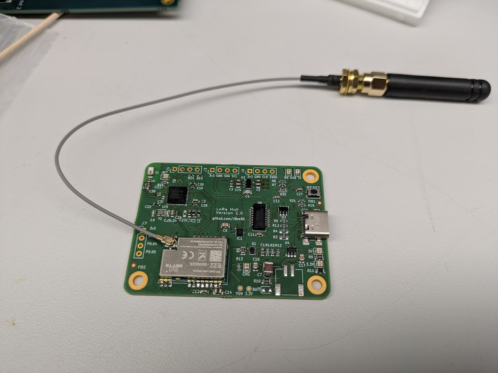
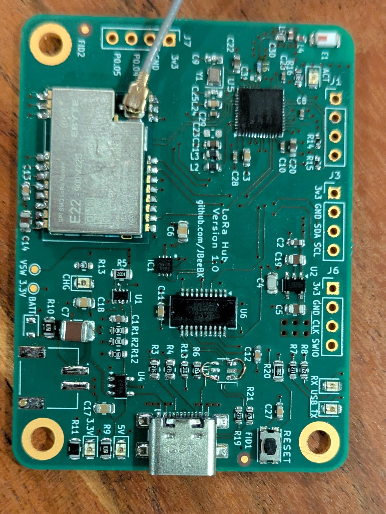

# Version 1.0 Bring-Up Notes

## Overview
First assembled prototype of the nRF52840 + SX1262 board.  

First run was a huge PITA to hand solder. I did the MCU and a few others with the oven and that went well, but the 0402s had not arrived yet and those took a bit of time. 
Not using BATT yet until firmware is running.

## Issues Found
### 1. USB ESD Protection (USBLC6-2SC6)
- **Problem:** D+ and D− were shorted because pins 1↔6 and 3↔4 were tied together incorrectly.
- **Fix:** Removed the ESD IC and jumpered D+ and D− directly through to the FTDI. Board enumerates correctly as a COM port after rework.

### 2. Bpost bent the stencil in the mail

### 3. I should have waited until I had all the components and just done one pass in the oven.

## Photos
| Description | Image |
|--------------|-------|
| Hand-soldered top side |  |
| ESD rework on USB lines |  |

## Next Steps
- Validate UART communication to nRF52840. Had to order some DAPlink converter because I have nothing like this.
- Verify SWD programming access.
- Begin firmware bring-up (blink test + UART loopback).

