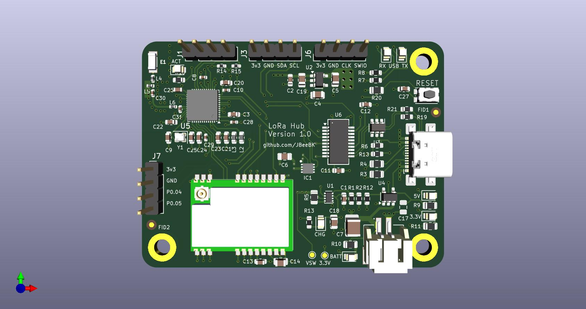

# NRF_LoRa

PCB design for a Nordic nRF52840 (QFN48) with SX1262 LoRa module.  
Designed as a low-power mesh node for experimentation and LoRaWan or Meshtastic development.

### Features
- nRF52840 SoC (BLE, Cortex-M4F)
- SX1262 LoRa (868 MHz) with SMA antenna
- USB-C input with TPS2116 power multiplexer
- MCP73831 LiPo charger and MAX17048 fuel gauge
- 2 x I²C headers for OLED and maybe card keyboard
- FT231XS USB-UART bridge for programming
- Compact 4-layer PCB (60 x 45 mm)
- Additional Header for 2GPIO

### Repository Structure
- `Hardware/` – KiCad source files (schematic, PCB, symbols, footprints)
- `Documents/` – Excel for pinout and pins used, net labels, etc.
- `Output_Pcb/` – Gerbers, fabrication layer PDFs
- `Output_Assembly/` – BOM, pick-and-place, schematic PDFs
- `Firmware/` – C++ file

This repo documents the hardware design; firmware will be added once the board is fabricated.

